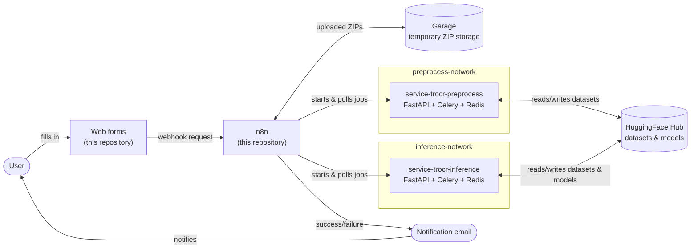

# Installation

This page describes how to set up the [n8n](https://docs.n8n.io/) environment that runs the Flow Project's
handwritten text recognition (HTR) pipeline. It covers what you need before you start,
the different ways you can run the environment, and the basic steps to get it going.

## What this environment is

The environment is a collection of Docker Compose files, ready-made n8n workflows, and
small web forms. Together they let an administrator or a researcher run preprocessing,
inference (recognition), and evaluation jobs without writing any code: a form is filled
in, a workflow does the work in the background, and an email is sent when the job is
done.

The environment itself only handles the orchestration: receiving requests, calling the
right service, watching the job, and reporting back. The actual preprocessing and
inference work is done by two separate services that you run alongside it:

- **Preprocessing service**: turns raw Page XML and image exports into datasets ready
  for training or inference.
- **Inference / evaluation service**: runs a trained model over a dataset and can
  evaluate its output against ground truth.

Both are published as their own repositories and are started with their own Docker
Compose files, independent of the n8n environment described here.



Everything in the top box (forms, n8n, Garage) comes from this repository and this
installation guide. The two service boxes are separate repositories with their own
compose files; see
[Running the preprocessing and inference services](#running-the-preprocessing-and-inference-services)
below. Traefik and the mail relay aren't shown here since they're optional add-ons
covered in their own sections.

## What you need to install it

- **[Docker and Docker Compose](https://docs.docker.com/compose/)** on the machine that
  will host the environment.
- **A way to send the workflow notification emails** described below: every workflow
  ends by emailing the user whether the job succeeded or failed, so pick one of the
  three options before you start, since it decides what goes in your `.env` file.
- If you want the environment reachable under a real domain, **a domain name with DNS
  access**. This is optional; see "Choosing a variant" below.

A **HuggingFace account and access token** is not needed to install the environment
itself. It only becomes relevant once someone actually submits a job through one of the
forms, since datasets and models are stored and exchanged as
[HuggingFace Hub](https://huggingface.co/docs/hub/index) repositories. Each form asks
for a HuggingFace token at submission time; nothing needs to be configured for it during
setup.

!!! warning "HuggingFace tokens are not stored as n8n credentials"
    The token a user types into a form is not saved anywhere as a reusable n8n
    credential. It travels through the webhook request as plain form data for that one
    job, which means it stays readable in that job's entry in n8n's
    [execution history](https://docs.n8n.io/hosting/scaling/execution-data/) for as
    long as n8n keeps it. Anyone with access to the n8n editor can read it there, so
    treat execution history as sensitive, and prefer [HuggingFace access tokens](https://huggingface.co/docs/hub/security-tokens)
    that are scoped to one repository and easy to revoke.

None of the preprocessing or inference work happens on your local machine by hand; it is
always triggered through n8n and carried out by the separate services mentioned above.

## Choosing a variant

The same stack can be started in a few different ways, depending on your network and
how public the environment should be.

| Variant | When to use it | Compose file |
| --- | --- | --- |
| Local / no domain | Development, testing, or a network without a domain or open ports 80/443 | `docker-compose.n8n.local.yml` |
| Domain-based | A proper deployment reachable under `n8n.yourdomain.com` and similar subdomains, behind [Traefik](https://doc.traefik.io/traefik/) | `docker-compose.n8n.yml` + `docker-compose.traefik-proxy.yml` |

Both variants run the same building blocks: n8n itself, a small S3-compatible storage
service called [Garage](https://garagehq.deuxfleurs.fr/documentation/quick-start/), and
the web forms. Garage is used only to temporarily hold
uploaded ZIP files until the preprocessing service can fetch them; a weekly cleanup job
removes anything older than seven days. It runs automatically as part of the compose
setup and needs no external account, just the secrets you generate for `.env`.

!!! tip "Start local first"
    If you are trying the environment out for the first time, the local variant is the
    easiest path: no domain, no TLS certificates, and no waiting on DNS changes.

## Notification emails

Every workflow finishes by sending an email to the user, reporting success or failure.
There is no separate solution for other kinds of outgoing mail (such as n8n's own
account invites or password resets). This setup only covers the workflow notification
emails. You have three options for sending them:

- **Mailjet**: create a [Mailjet](https://www.mailjet.com/) account and verify your
  domain there (they give you DNS records to add, so this still needs DNS access), then
  add the Mailjet credential in n8n. This is the default: every workflow already has an
  active Mailjet email node.
- **Gmail**: reuse an existing Gmail account via n8n's
  [Gmail credential](https://docs.n8n.io/integrations/builtin/credentials/send-email/gmail/)
  (OAuth login only). No DNS or domain access needed at all, at the cost of sending from a
  `@gmail.com` address instead of your own domain. Requires swapping in a Gmail node in
  place of the default Mailjet one.
- **Self-hosted mail relay**: a small Postfix + OpenDKIM container
  (`docker-compose.mailserver.local.yml` or `docker-compose.mailserver.yml`) that you run
  as an add-on on top of either base variant. It needs DNS access to publish a DKIM TXT
  record, and it delivers mail directly over outbound port 25, which most managed or
  secured networks block, so it only works reliably on an open network. To use it,
  disable the Mailjet email nodes in each workflow and enable the plain SMTP email nodes
  instead (each workflow ships with both, the SMTP ones disabled by default).

## Firewall, DNS, and infrastructure notes

Quick planning pointers, not a full network setup guide.

### Firewall

- Domain variant: open inbound 80/443 for Traefik's [Let's Encrypt](https://letsencrypt.org/how-it-works/)
  challenge, unless you switch to the [DNS-01 challenge](https://doc.traefik.io/traefik/https/acme/#dnschallenge),
  in which case no inbound port is needed for TLS at all.
- Local variant: only `5678` (n8n) and `80` (the forms) need to be reachable on your LAN;
  nothing needs to be open to the internet.
- Self-hosted mail relay: outbound port `25` must be open. Many managed or cloud networks
  block it, so check with your provider before picking this option.
- Everything else (Garage, Redis, the preprocessing/inference services) never needs a
  firewall rule of its own; they only talk to each other over the internal Docker
  networks and are never published to a host port.

### DNS

- The domain variant needs one record per subdomain in use (n8n, webhook, the form(s),
  optionally mail); a wildcard `*.yourdomain.com` record is the easiest way to cover all
  of them at once.
- Budget up to 48 hours for a DNS change to propagate before testing: a fresh or changed
  record can look "broken" for reasons unrelated to your setup.
- Mailjet's domain verification adds its own DNS records (Mailjet tells you which); the
  self-hosted mail relay instead needs a single DKIM TXT record.
- Consider SPF/DMARC records for your sending domain too. It's not something this
  environment configures for you, but it lowers the chance of notification emails
  landing in spam.

### Infrastructure

- A Linux host is the safest choice, since GPU support for the inference service depends
  on the [NVIDIA Container Toolkit](https://docs.nvidia.com/datacenter/cloud-native/container-toolkit/latest/index.html),
  which targets Linux.
- Give the host a static or reserved IP: both the domain variant's DNS records and the
  local variant's `SERVER_IP` assume the address doesn't change.
- Run only one Traefik instance per host on the shared `traefik-public` network; a second
  one competing for ports 80/443 will fail to start or quietly steal traffic.
- The n8n editor holds every stored credential used in this environment (storage, email,
  the services' API keys) plus the execution history, which includes the HuggingFace
  tokens submitted through the forms (see the warning above). If n8n is reachable under a
  public domain, consider restricting access to it further (a VPN, an IP allowlist, or a
  Traefik auth middleware) rather than leaving it open to anyone who finds the subdomain.

## Basic setup steps

1. **Copy the matching `.env` template**: `.env.example` for the domain variant,
   `.env.local.example` for the local variant, to `.env`, and fill in the values:
   your domain name or the server's LAN IP, the n8n `ENCRYPTION_KEY`
   (`openssl rand -hex 32`), and the Garage storage secrets (also generated with
   `openssl rand`, see the comments in the template file). If you chose the self-hosted
   mail relay, also fill in its `DOMAIN_NAME`, `SUBDOMAIN_MAIL`, and `DKIM_SELECTOR`
   values.
2. **Create the Docker networks** the environment expects:
    - Domain variant: `traefik-public` (Traefik ingress) and `preprocess-network`.
    - Local variant: `inference-network` and `preprocess-network`.

    These two `*-network` networks are how n8n reaches the preprocessing and inference
    services, which run in their own, separate compose stacks; each of those stacks
    joins whichever network fits, and n8n then calls it by container name
    (`http://my-api:<port>`). An API on another machine on the LAN needs no such network,
    just its IP; an API running directly on the host itself needs
    `host.docker.internal` added to n8n's `extra_hosts`.

3. **Start the compose file for your variant**, adding the mail relay file on top if you
   chose that option, for example:

    ```bash
    docker compose -f docker-compose.n8n.local.yml -f docker-compose.mailserver.local.yml up -d
    ```

4. **Start the preprocessing and inference services** from their own repositories, on
   the matching `*-network`, so the workflows can reach them by container name.
5. **Open the n8n web interface**, add the required
   [credentials](https://docs.n8n.io/credentials/) (S3/Garage and your chosen email
   option; HuggingFace tokens are entered per-request in the forms, not configured
   here), and import the workflow JSON files from this repository's `workflows-*`
   folders. Workflows are not started automatically. An administrator imports each one
   through the n8n interface and activates it there.

    !!! warning "Importing the workflows is not enough on its own"
        Every Header Auth field on every webhook and every "POST/GET" node ships
        **unassigned** on purpose: none of the workflow files carry a working credential,
        since credentials are never included in an export. Each workflow stays broken
        until you create and link three Header Auth credentials in the n8n UI:

        - **One shared "Webhook API Key"**: select it on every `Webhook: Receive …`
          node, across all five workflows. This is the **only** key you give to your
          users; it's what they type into each form's "Webhook API key" field.
        - **One "Preprocessing Service API Key"**, matching the `API_KEY` you set in
          `service-trocr-preprocess`'s `.env`; select it on the `POST:`/`GET:` nodes in
          the two preprocessing workflows.
        - **One "Inference Service API Key"**, matching the `API_KEY` you set in
          `service-trocr-inference`'s `.env`; select it on the `POST:`/`GET:` nodes in
          the inference, evaluation, and write raw XML workflows.

        You need to know both services' `API_KEY` values yourself (see
        [Running the preprocessing and inference services](#running-the-preprocessing-and-inference-services)
        below); never hand those out to end users, only the shared webhook key.

6. **Point the forms at the webhook.** The form pages read their webhook address from a
   small generated `config.js` file rather than having it hardcoded, so the same form
   works unchanged across deployments:
    - Domain variant images already default to `https://webhook.<your-domain>`.
    - The local variant image writes it at container start from the `WEBHOOK_BASE_URL`
      value in the compose file (typically `http://<SERVER_IP>:5678`).

!!! example "Reproducible commands (steps 1-3)"
    === "Local / no domain"
        ```bash
        cd docker-templates

        # 2. shared networks, so n8n can reach sibling services by container name
        docker network create inference-network
        docker network create preprocess-network

        # 1. environment file
        cp .env.local.example .env
        # now edit .env: set SERVER_IP, ENCRYPTION_KEY, and the GARAGE_* secrets

        # 3. start the stack
        docker compose -f docker-compose.n8n.local.yml up -d

        # optional: self-hosted mail relay instead of Mailjet/Gmail
        docker compose -f docker-compose.n8n.local.yml -f docker-compose.mailserver.local.yml up -d
        ```

    === "Domain-based"
        ```bash
        cd docker-templates

        # 2. shared networks, so n8n can reach sibling services by container name
        docker network create traefik-public
        docker network create preprocess-network

        # 1. environment file
        cp .env.example .env
        # now edit .env: set DOMAIN_NAME, the subdomains, SSL_EMAIL, ENCRYPTION_KEY,
        # and the GARAGE_* secrets

        # 3. start the reverse proxy, then the stack
        docker compose -f docker-compose.traefik-proxy.yml up -d
        docker compose -f docker-compose.n8n.yml up -d

        # optional: self-hosted mail relay instead of Mailjet/Gmail
        docker compose -f docker-compose.n8n.yml -f docker-compose.mailserver.yml up -d
        ```

    Steps 4-6 (starting the sibling services, importing the workflows, and setting the
    webhook URL) are done once through the n8n web interface and the sibling services'
    own compose files, not from this repository.

## Running the preprocessing and inference services

n8n only dispatches jobs. The two services below do the actual work, and each is its
own repository with its own Docker Compose setup, run independently of the compose files
in this repository:

- **Preprocessing service**:
  [github.com/The-Flow-Project/service-trocr-preprocess](https://github.com/The-Flow-Project/service-trocr-preprocess)
- **Inference / evaluation service**:
  [github.com/The-Flow-Project/service-trocr-inference](https://github.com/The-Flow-Project/service-trocr-inference)

Both are built the same way: a [FastAPI](https://fastapi.tiangolo.com/) app, a
[Celery](https://docs.celeryq.dev/en/stable/) background worker, and a
[Redis](https://redis.io/docs/latest/) instance for job status and queueing, all defined
in that repository's own `docker-compose.yml`. To bring one up so this environment's
workflows can reach it:

1. Clone the repository and copy its `.env.example` to `.env`. Set `API_KEY` to a secret
   of your own choosing; every request to the service must carry it, including the ones
   n8n sends.
2. Make sure it joins the network the matching workflow expects: the same network you
   already created in [Basic setup steps](#basic-setup-steps) above:
    - Preprocessing service → `preprocess-network`
    - Inference / evaluation service → `inference-network`

3. Keep the container name as shipped in that repository's compose file
   (`service-trocr-preprocess` or `service-trocr-inference`). The imported n8n workflows
   call the service at exactly that name on port 8000; renaming the container breaks the
   connection unless you also edit the workflow's HTTP Request nodes.
4. Start it. Both repositories support the same two modes:
    - **Local / testing**: a bare `docker compose up -d --build` also publishes the API
      on `:8000`, handy for checking the connection by hand
      (`curl http://localhost:8000/health`, no API key needed for this endpoint).
    - **Behind Traefik**: `docker compose -f docker-compose.yml -f docker-compose.traefik.yml up -d --build`
      publishes no host port; the service is reachable only through Traefik and the
      `APP_DOMAIN` set in its `.env`.

    Either way, Redis and the Celery worker start together with the API, with no separate
    step needed.

5. Add the service's `API_KEY` as a
   [Header Auth credential](https://docs.n8n.io/integrations/builtin/credentials/httprequest/#header-auth)
   in n8n (named "Preprocessing Service API Key" or "Inference Service API Key", as
   described in step 5 of [Basic setup steps](#basic-setup-steps)), and select it on that
   workflow's `POST:`/`GET:` nodes. This is a **different** credential from the shared
   webhook key end users type into the forms: this one authenticates n8n itself against
   the backend service, and must match the `API_KEY` value you set in that service's
   `.env` in step 1 above.

!!! tip "GPU support (inference service only)"
    If the host has an NVIDIA GPU and the
    [NVIDIA Container Toolkit](https://docs.nvidia.com/datacenter/cloud-native/container-toolkit/latest/index.html)
    installed, add `docker-compose.gpu.yml` on top of whichever command you used in step
    4, for example:
    ```bash
    docker compose -f docker-compose.yml -f docker-compose.traefik.yml -f docker-compose.gpu.yml up -d --build
    ```
    Without it, inference and training run on CPU, which works but is considerably
    slower.

Once this is done, the landing page lists a form for each available task:
preprocessing, inference, writing raw XML, and evaluation. See the
[Tutorials](../tutorials/preprocessing_zip_raw_xml.md) section for a walkthrough of each
one.
