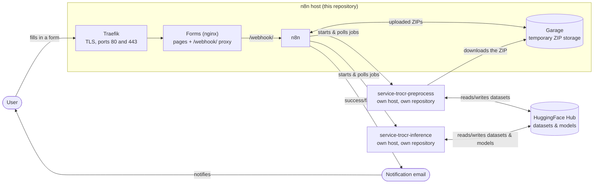

# Installation

This page describes how to set up the [n8n](https://docs.n8n.io/) environment that runs the Flow Project's
handwritten text recognition (HTR) pipeline. It covers what you need before you start,
the different ways you can run the environment, and the basic steps to get it going.

## What this environment is

The environment is a collection of Docker Compose files, ready-made n8n workflows, and
small web forms. Together they let an administrator or a researcher run preprocessing,
inference (recognition), and evaluation jobs without writing any code: a form is filled
in, a workflow does the work in the background, and an email is sent when the job is
done.

The environment itself only handles the orchestration: receiving requests, calling the
right service, watching the job, and reporting back. The actual preprocessing and
inference work is done by two separate services that you run alongside it:

- **Preprocessing service**: turns raw Page XML and image exports into datasets ready
  for training or inference.
- **Inference / evaluation service**: runs a trained model over a dataset and can
  evaluate its output against ground truth.

Both are published as their own repositories and are started with their own Docker
Compose files, independent of the n8n environment described here.



Everything in the box comes from this repository and this installation guide. Note the
shape of it: the user only ever talks to the forms container. The forms are static pages
served by an nginx that also passes `/webhook/` requests through to n8n, so pages and
webhooks share a single address. n8n itself, Garage, and the two services are never
reachable from outside.

The two services are separate repositories with their own compose files, and they can run
on the same host or on other machines; see
[Running the preprocessing and inference services](#running-the-preprocessing-and-inference-services)
below. The mail relay is not shown here since it is an optional add-on covered in its own
section.

## What you need to install it

- **[Docker and Docker Compose](https://docs.docker.com/compose/)** on the machine that
  will host the environment.
- **A way to send the workflow notification emails** described below: every workflow
  ends by emailing the user whether the job succeeded or failed, so pick one of the
  three options before you start, since it decides what goes in your `.env` file.
- If you want the environment reachable under a real domain, **a domain name with DNS
  access**. This is optional; see "Choosing a variant" below.

A **HuggingFace account and access token** is not needed to install the environment
itself. It only becomes relevant once someone actually submits a job through one of the
forms, since datasets and models are stored and exchanged as
[HuggingFace Hub](https://huggingface.co/docs/hub/index) repositories. Each form asks
for a HuggingFace token at submission time; nothing needs to be configured for it during
setup.

!!! warning "HuggingFace tokens are not stored as n8n credentials"
    The token a user types into a form is not saved anywhere as a reusable n8n
    credential. It travels through the webhook request as plain form data for that one
    job, which means it stays readable in that job's entry in n8n's
    [execution history](https://docs.n8n.io/hosting/scaling/execution-data/) for as
    long as n8n keeps it. Anyone with access to the n8n editor can read it there, so
    treat execution history as sensitive, and prefer [HuggingFace access tokens](https://huggingface.co/docs/hub/security-tokens)
    that are scoped to one repository and easy to revoke.

None of the preprocessing or inference work happens on your local machine by hand; it is
always triggered through n8n and carried out by the separate services mentioned above.

## How much of it is public

There is one stack, not two variants. `docker-compose.yml` starts the whole environment
with nothing published to the internet, and a small overlay file publishes the forms
under a domain name on top of that. You pick how far you go:

| How you run it | What it gives you | Command |
| --- | --- | --- |
| Internal only | Everything reachable by the host's LAN address. No domain, no TLS, no waiting on DNS | `docker compose up -d` |
| Published | The forms reachable at `https://flow.example.com`, behind [Traefik](https://doc.traefik.io/traefik/) with a Let's Encrypt certificate | add `-f docker-compose.public.yml`, plus `docker-compose.traefik.yml` for the proxy |

The overlay adds routing for the forms container and for nothing else, so publishing the
environment never exposes n8n, Garage, or the services.

The building blocks are the same either way: n8n itself, a small S3 compatible storage
service called [Garage](https://garagehq.deuxfleurs.fr/documentation/quick-start/), and
the web forms. Garage is used only to temporarily hold uploaded ZIP files until the
preprocessing service can fetch them; a weekly cleanup job removes anything older than
seven days. It runs automatically as part of the compose setup and needs no external
account, just the secrets you generate for `.env`.

!!! tip "Start internal first"
    If you are trying the environment out for the first time, run it without the overlay:
    no domain, no TLS certificates, and no waiting on DNS changes. Adding the domain later
    is a matter of two `.env` values and one extra `-f` flag, with nothing to rebuild.

!!! note "Only the forms need a domain"
    n8n gets no domain name of its own and no DNS record. Because the forms nginx passes
    `/webhook/` through to n8n, both live at the same address, which means one record
    instead of several, no CORS setup, and no public route to the n8n editor. If you
    cannot get DNS records created easily, this is the part that makes it workable.

## Notification emails

Every workflow finishes by sending an email to the user, reporting success or failure.
There is no separate solution for other kinds of outgoing mail (such as n8n's own
account invites or password resets). This setup only covers the workflow notification
emails. You have three options for sending them:

- **Mailjet**: create a [Mailjet](https://www.mailjet.com/) account and verify your
  domain there (they give you DNS records to add, so this still needs DNS access), then
  add the Mailjet credential in n8n. This is the default: every workflow already has an
  active Mailjet email node.
- **Gmail**: reuse an existing Gmail account via n8n's
  [Gmail credential](https://docs.n8n.io/integrations/builtin/credentials/send-email/gmail/)
  (OAuth login only). No DNS or domain access needed at all, at the cost of sending from a
  `@gmail.com` address instead of your own domain. Requires swapping in a Gmail node in
  place of the default Mailjet one.
- **Self-hosted mail relay**: a small Postfix + OpenDKIM container
  (`docker-compose.mailserver.yml`) that you run as an add-on on top of the stack,
  published or not. It needs DNS access to publish a DKIM TXT
  record, and it delivers mail directly over outbound port 25, which most managed or
  secured networks block, so it only works reliably on an open network. To use it,
  disable the Mailjet email nodes in each workflow and enable the plain SMTP email nodes
  instead (each workflow ships with both, the SMTP ones disabled by default).

## Firewall, DNS, and infrastructure notes

Quick planning pointers, not a full network setup guide.

### Firewall

- Published: open inbound `80` and `443`, and only those. Port 80 is needed both for the
  redirect to HTTPS and for Traefik's [Let's Encrypt](https://letsencrypt.org/how-it-works/)
  challenge, unless you switch to the [DNS-01 challenge](https://doc.traefik.io/traefik/https/acme/#dnschallenge),
  which needs API access to your DNS zone but no inbound port.
- Internal only: `80` (the forms) and `5678` (the n8n editor) on your LAN, nothing open to
  the internet.
- The n8n editor on `5678` stays internal in both cases. It holds every credential and the
  execution history, so it should never be forwarded at the firewall. Bind it to one
  interface with `N8N_BIND_ADDR`, or drop the published port entirely and reach it through
  an SSH tunnel: `ssh -L 5678:localhost:5678 user@host`.
- Port `3902` (uploaded file downloads) needs to be reachable only from the machines
  running the preprocessing and inference services, and never from the internet. The
  environment already restricts it to those addresses; see
  [Running the preprocessing and inference services](#running-the-preprocessing-and-inference-services).
- Self-hosted mail relay: outbound port `25` must be open. Many managed or cloud networks
  block it, so check with your provider before picking this option.

!!! tip "Preparing before the ports are opened"
    On a managed network you may have to hand the setup over for review before anyone
    opens 80 and 443. Start Traefik anyway: while the ports are closed it serves its own
    self signed certificate, so the site already works inside the network, and browsers
    only warn about the certificate. Keep `ACME_CASERVER` pointed at the Let's Encrypt
    **staging** directory during that phase, because repeated failed validations against
    the production one exhaust its rate limit. Switch it to production, delete the stored
    certificate, and restart Traefik the day the ports open. The comments at the top of
    `docker-compose.traefik.yml` give the exact sequence.

### DNS

- One record is enough: the hostname the forms are published under. n8n, the webhooks and
  the storage have no hostnames of their own, so there is nothing else to request, and no
  wildcard is needed.
- Budget up to 48 hours for a DNS change to propagate before testing: a fresh or changed
  record can look "broken" for reasons unrelated to your setup. Until the record exists
  you can test from inside the network with an entry in your hosts file, since the proxy
  routes on the Host header.
- Mailjet's domain verification adds its own DNS records (Mailjet tells you which); the
  self-hosted mail relay instead needs a single DKIM TXT record. The mail domain is
  independent of the one the forms use.
- Consider SPF/DMARC records for your sending domain too. It's not something this
  environment configures for you, but it lowers the chance of notification emails
  landing in spam.

### Infrastructure

- A Linux host is the safest choice, since GPU support for the inference service depends
  on the [NVIDIA Container Toolkit](https://docs.nvidia.com/datacenter/cloud-native/container-toolkit/latest/index.html),
  which targets Linux.
- Give the host a static or reserved IP: the DNS record, the `N8N_LAN_HOST` value, and the
  address the services download uploads from all assume it doesn't change.
- Run only one Traefik instance per host on the shared `traefik-public` network; a second
  one competing for ports 80/443 will fail to start or quietly steal traffic.
- The n8n editor holds every stored credential used in this environment (storage, email,
  the services' API keys) plus the execution history, which includes the HuggingFace
  tokens submitted through the forms (see the warning above). The environment gives it no
  public route for exactly that reason. Keep it that way: reach it over the LAN or an SSH
  tunnel, and do not add a proxy route for it.

## Basic setup steps

1. **Copy `.env.example` to `.env`** and fill in the values: the host's LAN address
   (`N8N_LAN_HOST`), the address users reach the forms at (`PUBLIC_BASE_URL`), the n8n
   `ENCRYPTION_KEY` (`openssl rand -hex 32`), the Garage storage secrets (also generated
   with `openssl rand`, see the comments in the template), and the addresses of the two
   services (`PREPROCESS_API_BASE`, `INFERENCE_API_BASE`, and the matching
   `*_SERVER_IP` values). If you are publishing the environment, also set `PUBLIC_HOST`
   and `SSL_EMAIL`; if you chose the self-hosted mail relay, its `MAIL_DOMAIN`,
   `MAIL_HOSTNAME`, and `DKIM_SELECTOR`.

    There is one template for both ways of running it. Every value that only matters when
    publishing is grouped under its own heading in the file.

2. **Create the Docker network**, but only if you are publishing the environment:
   `docker network create traefik-public`. It is the network Traefik and the forms
   container share. Running internally only, there is nothing to create: compose makes
   the stack's own private network for you.

3. **Start the stack**, adding the overlay files you need:

    ```bash
    docker compose up -d                                    # internal only
    docker compose -f docker-compose.yml \
                   -f docker-compose.public.yml up -d       # published
    ```

    Add `-f docker-compose.mailserver.yml` on top of either if you chose the self-hosted
    mail relay, and start the proxy once per host with
    `docker compose -f docker-compose.traefik.yml up -d`.

4. **Start the preprocessing and inference services** from their own repositories, and
   make sure the addresses you put in `PREPROCESS_API_BASE` and `INFERENCE_API_BASE`
   actually reach them.
5. **Open the n8n web interface**, add the required
   [credentials](https://docs.n8n.io/credentials/) (S3/Garage and your chosen email
   option; HuggingFace tokens are entered per-request in the forms, not configured
   here), and import the workflow JSON files from this repository's `workflows/`
   folder. Workflows are not started automatically. An administrator imports each one
   through the n8n interface and activates it there.

    !!! warning "Importing the workflows is not enough on its own"
        Every Header Auth field on every webhook and every "POST/GET" node ships
        **unassigned** on purpose: none of the workflow files carry a working credential,
        since credentials are never included in an export. Each workflow stays broken
        until you create and link three Header Auth credentials in the n8n UI:

        - **One shared "Webhook API Key"**: select it on every `Webhook: Receive …`
          node, across all five workflows. This is the **only** key you give to your
          users; it's what they type into each form's "Webhook API key" field.
        - **One "Preprocessing Service API Key"**, matching the `API_KEY` you set in
          `service-trocr-preprocess`'s `.env`; select it on the `POST:`/`GET:` nodes in
          the two preprocessing workflows.
        - **One "Inference Service API Key"**, matching the `API_KEY` you set in
          `service-trocr-inference`'s `.env`; select it on the `POST:`/`GET:` nodes in
          the inference, evaluation, and write raw XML workflows.

        You need to know both services' `API_KEY` values yourself (see
        [Running the preprocessing and inference services](#running-the-preprocessing-and-inference-services)
        below); never hand those out to end users, only the shared webhook key.

6. **Choose which forms to offer.** `ENABLED_FORMS` in `.env` lists the pipeline stages
   this instance runs, for example `ENABLED_FORMS=preprocessing` if you only run the
   preprocessing service. Anything left out loses its card on the landing page and its
   navigation tab, and its address returns 404. The default lists all four.

    There is nothing to configure for the webhook address itself. The forms post to
    `/webhook/<name>` on whatever host they were loaded from, and the nginx serving them
    passes that through to n8n, so the same image works in every deployment.

!!! example "Reproducible commands (steps 1-3)"
    === "Internal only"
        ```bash
        cd deploy

        # 1. environment file
        cp .env.example .env
        # now edit .env: set N8N_LAN_HOST, PUBLIC_BASE_URL (the host's own address here),
        # ENCRYPTION_KEY, the GARAGE_* secrets, and the two service addresses.
        # Keep FORMS_HTTP_PORT=80 and FORMS_BIND_ADDR=0.0.0.0 so the LAN can reach the forms.

        # 2. nothing to create: compose makes the stack's private network itself

        # 3. start the stack
        docker compose up -d

        # optional: self-hosted mail relay instead of Mailjet/Gmail
        docker compose -f docker-compose.yml -f docker-compose.mailserver.yml up -d
        ```

    === "Published under a domain"
        ```bash
        cd deploy

        # 1. environment file
        cp .env.example .env
        # now edit .env: as above, plus PUBLIC_HOST, PUBLIC_BASE_URL (https://...),
        # SSL_EMAIL, and FORMS_HTTP_PORT=8080 with FORMS_BIND_ADDR=127.0.0.1 so the
        # forms container leaves ports 80 and 443 to Traefik.

        # 2. the network Traefik and the forms container share
        docker network create traefik-public

        # 3. start the reverse proxy once per host, then the stack
        docker compose -f docker-compose.traefik.yml up -d
        docker compose -f docker-compose.yml -f docker-compose.public.yml up -d

        # optional: self-hosted mail relay instead of Mailjet/Gmail
        docker compose -f docker-compose.yml -f docker-compose.public.yml \
                       -f docker-compose.mailserver.yml up -d
        ```

    Steps 4-6 (starting the sibling services, importing the workflows, and choosing which
    forms to offer) are done through the n8n web interface, the sibling services' own
    compose files, and one `.env` value.

## Running the preprocessing and inference services

n8n only dispatches jobs. The two services below do the actual work, and each is its
own repository with its own Docker Compose setup, run independently of the compose files
in this repository:

- **Preprocessing service**:
  [github.com/The-Flow-Project/service-trocr-preprocess](https://github.com/The-Flow-Project/service-trocr-preprocess)
- **Inference / evaluation service**:
  [github.com/The-Flow-Project/service-trocr-inference](https://github.com/The-Flow-Project/service-trocr-inference)

Both are built the same way: a [FastAPI](https://fastapi.tiangolo.com/) app, a
[Celery](https://docs.celeryq.dev/en/stable/) background worker, and a
[Redis](https://redis.io/docs/latest/) instance for job status and queueing, all defined
in that repository's own `docker-compose.yml`. To bring one up so this environment's
workflows can reach it:

1. Clone the repository and copy its `.env.example` to `.env`. Set `API_KEY` to a secret
   of your own choosing; every request to the service must carry it, including the ones
   n8n sends.
2. Decide where it runs and tell n8n its address. The workflows do not hardcode it: their
   HTTP nodes read it from the n8n container's environment, so the service can live on any
   machine the n8n host can reach.

    ```bash
    # in the n8n environment's .env
    PREPROCESS_API_BASE=http://10.0.0.11:8000
    INFERENCE_API_BASE=http://10.0.0.12:8000
    ```

    Moving a service to a different machine later is a change to this value followed by
    `docker compose up -d`, with no need to re-import any workflow. The services should be
    reachable from the n8n host and from nowhere else: they need no domain, no proxy route,
    and no port open to the internet.

3. Let the service download uploaded ZIPs. The preprocessing service fetches the file the
   user uploaded from Garage over plain HTTP, so add the machine it runs on to
   `PREPROCESS_SERVER_IP` (and the inference machine to `INFERENCE_SERVER_IP`). Those two
   values are an allow list: only the addresses listed there may download from Garage, and
   everything else gets a 403. A single IP or a CIDR such as `10.0.0.0/24` both work.

    Leave the pair empty for a service you do not run. Nothing else needs changing.
4. Start it. Both repositories support the same two modes:
    - **Published on the network**: a bare `docker compose up -d --build` publishes the API
      on `:8000`, which is what `PREPROCESS_API_BASE` and `INFERENCE_API_BASE` point at, and
      what lets you check the connection by hand
      (`curl http://<service-host>:8000/health`, no API key needed for this endpoint).
      Restrict that port to the n8n host at your firewall.
    - **Behind Traefik**: `docker compose -f docker-compose.yml -f docker-compose.traefik.yml up -d --build`
      publishes no host port; the service is reachable only through Traefik and the
      `APP_DOMAIN` set in its `.env`. Only worth it if that service already sits behind a
      proxy for other reasons, since n8n reaches it perfectly well over the internal
      network. If you do use it, point the `*_API_BASE` value at the `APP_DOMAIN` instead
      of the IP, and keep that hostname off the public internet.

    Either way, Redis and the Celery worker start together with the API, with no separate
    step needed.

5. Add the service's `API_KEY` as a
   [Header Auth credential](https://docs.n8n.io/integrations/builtin/credentials/httprequest/#header-auth)
   in n8n (named "Preprocessing Service API Key" or "Inference Service API Key", as
   described in step 5 of [Basic setup steps](#basic-setup-steps)), and select it on that
   workflow's `POST:`/`GET:` nodes. This is a **different** credential from the shared
   webhook key end users type into the forms: this one authenticates n8n itself against
   the backend service, and must match the `API_KEY` value you set in that service's
   `.env` in step 1 above.

!!! tip "GPU support (inference service only)"
    If the host has an NVIDIA GPU and the
    [NVIDIA Container Toolkit](https://docs.nvidia.com/datacenter/cloud-native/container-toolkit/latest/index.html)
    installed, add `docker-compose.gpu.yml` on top of whichever command you used in step
    4, for example:
    ```bash
    docker compose -f docker-compose.yml -f docker-compose.traefik.yml -f docker-compose.gpu.yml up -d --build
    ```
    Without it, inference and training run on CPU, which works but is considerably
    slower.

Once this is done, the landing page lists a form for each available task:
preprocessing, inference, writing raw XML, and evaluation. See the
[Tutorials](../tutorials/preprocessing_zip_raw_xml.md) section for a walkthrough of each
one.
