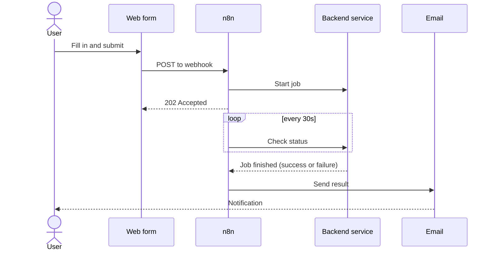

# n8n in the Flow environment

[n8n](https://n8n.io/) is the tool that ties the different steps of the handwritten text
recognition (HTR) pipeline together. This page explains what it does, why it was chosen,
and how the pieces in this repository fit together.

!!! tip "First login"
    The first time you open n8n's web interface, it asks you to create a local admin
    (owner) account: a name, email, and password stored in n8n itself. No registration
    with n8n.io is needed for this; that would only apply to n8n's paid cloud offering,
    not the self-hosted community edition used here.

## What n8n does here

n8n is a workflow automation tool. Instead of writing a script for "receive a request,
call a service, wait for it to finish, send an email", you build that logic visually as
a chain of connected steps, called nodes. Each workflow in this repository is one such
chain, saved as a JSON file and imported into n8n through its web interface.

In the Flow environment, n8n plays the role of a dispatcher between the people using the
system and the services that do the actual work:

1. A user fills in one of the web forms (preprocessing, inference, writing raw XML, or
   evaluation).
2. The form sends the data to an n8n **webhook**: a URL that starts a workflow when it
   receives a request.
3. The workflow checks the request, stores any uploaded files, and calls the matching
   backend service to start a job.
4. n8n waits and periodically checks on the job's progress.
5. Once the job succeeds or fails, n8n sends an email to the user with the outcome.

Because this logic lives in n8n rather than in each service, the preprocessing and
inference services themselves can stay simple: they only need to expose a "start a job"
and a "check status" endpoint, and n8n handles the waiting, retrying, and notifying.

## Why n8n

- **Visual and inspectable.** A workflow can be opened and read as a diagram, so an
  administrator without programming experience can follow what happens for a given
  request, or make a small adjustment (an email text, a delay, a condition) without
  touching code.
- **Self-hosted.** The whole pipeline, including the storage and email credentials it
  uses and the HuggingFace tokens submitted through it, stays on infrastructure the Flow
  environment controls, rather than sending data through a third-party automation
  service.
- **Built-in webhooks and scheduling.** Every workflow in this repository starts from a
  [webhook](https://docs.n8n.io/integrations/builtin/core-nodes/n8n-nodes-base.webhook/),
  and the weekly storage cleanup workflow starts from a schedule; both are handled by
  n8n itself, with no extra infrastructure needed.
- **Credentials are centralized.** Storage keys, email accounts, and other
  [credentials](https://docs.n8n.io/credentials/) are stored once as n8n credentials and
  reused across workflows, instead of being copied into separate scripts or services.
  HuggingFace tokens are the exception; see "Data and backups" below.

## The workflows in this repository

| Workflow | Folder | Starts from | What it does |
| --- | --- | --- | --- |
| ZIP preprocessing | `workflows-preprocessing` | Preprocessing form (ZIP URL or upload) | Prepares a dataset from a ZIP of Page XML and images |
| HuggingFace preprocessing | `workflows-preprocessing` | Preprocessing form (HuggingFace source) | Prepares a dataset from an existing HuggingFace dataset |
| Inference | `workflows-inference` | Inference form | Runs a trained model over a dataset |
| Write raw XML | `workflows-write-rawxml` | Write raw XML form | Merges inference results back into the original Page XML |
| Evaluation | `workflows-evaluation` | Evaluation form | Compares model output against ground truth |
| Garage upload cleanup | `workflows-preprocessing` | Weekly schedule | Removes temporary ZIP uploads older than seven days |

!!! note "Importing workflows is a required, manual step"
    n8n does not pick up the workflow JSON files from this repository by itself. An
    administrator has to import each one through the n8n web interface (Workflows →
    Import from File) and activate it there before its webhook or schedule starts
    responding.

All of the request-driven workflows follow the same shape: receive the request, confirm
it was accepted, call the backend service, poll its status every 30 seconds, and email
the result. Once you recognize this pattern in one workflow, the others read the same
way.

## Notifications

Every workflow ends in two possible branches, success or failure, each ending in an
email node. By default this email is sent through **Mailjet**, using a workflow-level
credential, independent of how the Docker environment itself is set up. A plain SMTP
email node also exists in each workflow but is disabled by default; it is meant for
deployments that use a self-hosted mail relay instead of Mailjet, in which case the
Mailjet nodes are disabled and the SMTP ones are enabled instead. See
[Installation](../getting_started/installation.md) for how the notification email
options compare.

## Data and backups

All of n8n's own data (imported workflows, credentials, and execution history) lives
in a single Docker volume, not in this repository.

!!! warning "Back up the n8n volume regularly"
    Nothing in this repository recreates your imported workflows, credentials, or
    execution history: that data only exists in the n8n container's Docker volume. Back
    it up on a regular schedule. The same backup can be restored onto a new host to
    migrate the environment, so keep it somewhere separate from the machine it came from.

!!! warning "HuggingFace tokens are not n8n credentials"
    The HuggingFace token a user enters in a form is never saved as a reusable n8n
    credential. It arrives as plain data in that request's webhook payload and stays
    visible in that job's entry in n8n's
    [execution history](https://docs.n8n.io/hosting/scaling/execution-data/) for as long
    as n8n retains it. Anyone with access to the n8n editor can read it there, so
    restricting who can open the editor (see
    [Installation](../getting_started/installation.md)) matters just as much for these
    tokens as it does for the stored credentials.

## Where to go next

See the [Tutorials](../tutorials/preprocessing_zip_raw_xml.md) section for a step-by-step
walkthrough of each form and workflow, or [Installation](../getting_started/installation.md)
for how to set the environment up in the first place.
