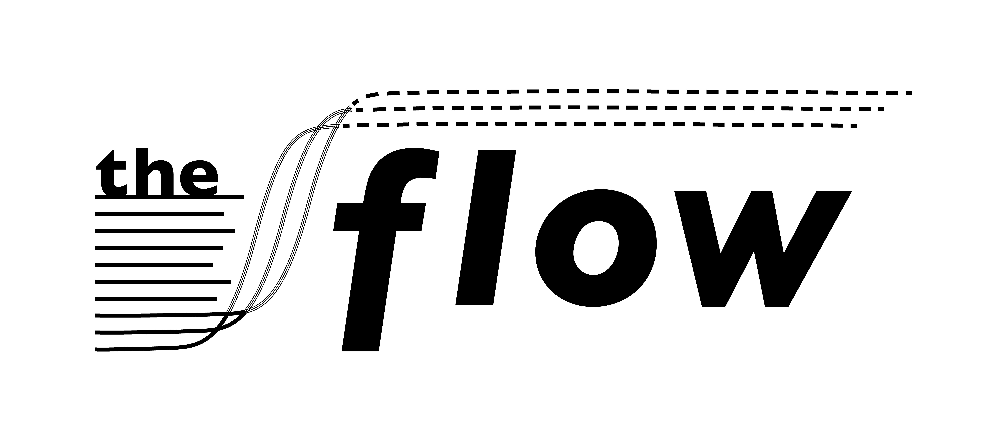
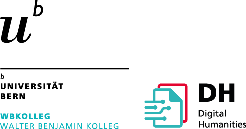
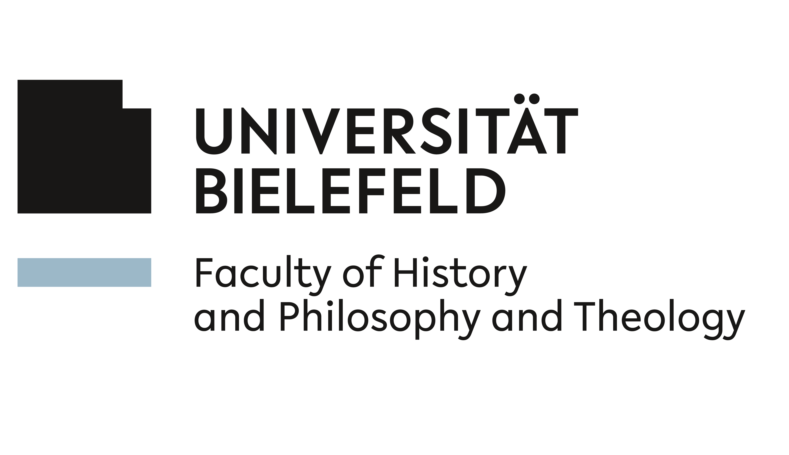
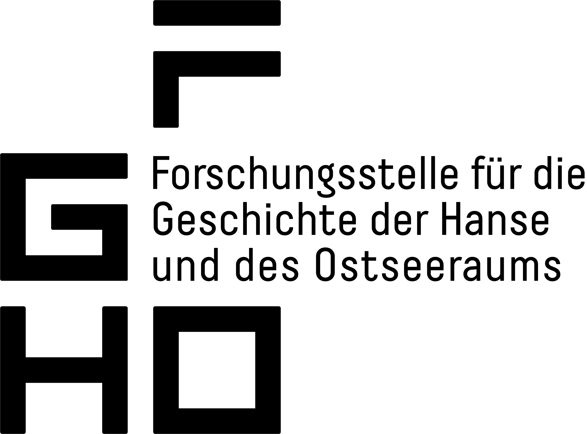

# The Flow Project

This is the documentation of the **Flow Project**, which is a collaborative research initiative (2023–2026) funded by the Swiss National Science Foundation (SNF) and the German Research Foundation (DFG).

## What is Flow?

Flow develops standardized, user-friendly digital workflows for historians and humanities researchers working with premodern historical sources. The goal is to make machine-learning capabilities accessible without requiring data science expertise, enabling corpus-level analysis of extended document collections.

## What can you do with it?

- **Preprocessing** Prepare your data for further HTR tasks  
- **Handwritten Text Recognition (HTR)** Transcribe historical manuscripts automatically  
- **Data Management** Manage your existing data via [HuggingFace Hub](https://huggingface.co)

## How is it structured?

The Flow environment is modular. It consists of independent [packages](packages.md) (Python libraries) and [services](services.md) (FastAPI microservices) that cover the HTR/ATR pipeline: preprocessing, inference, and evaluation. These are orchestrated through an [n8n](https://n8n.io/) automation environment, so the pipeline can be run through web forms without writing code.

## Where to start

- **New to Flow?** Start with the [Installation guide](getting_started/installation.md) to set up the n8n environment.
- **Ready to run the pipeline?** Read the [n8n environment overview](htr_workflow/n8n.md), then follow the tutorials for [preprocessing](tutorials/preprocessing_zip_raw_xml.md), [inference](tutorials/inference.md), [evaluation](tutorials/evaluation.md), and [writing results back](tutorials/write_raw_xml.md).
- **Curious about the tech?**  Browse the [Packages](packages.md) and [Services](services.md) reference.
- **Have a question or found an issue?**  Check the [FAQ](help/faq.md) or see how to [contribute](help/contributing.md).

## Partners

Developed jointly by the University of Bern (Digital Humanities), the University of Bielefeld (Digital History), and the Research Centre for Hanse and Baltic History, Lübeck.

{ target="_blank" rel="noopener" }
{ target="_blank" rel="noopener" }
{ target="_blank" rel="noopener" }

## License

This documentation, and the packages and services that make up the Flow environment, are
released under the
[MIT license](https://github.com/The-Flow-Project/flow-docs/blob/main/LICENSE){ target="_blank" rel="noopener" }.
n8n itself is licensed separately, under its own
[Sustainable Use License](https://docs.n8n.io/sustainable-use-license/){ target="_blank" rel="noopener" };
see the [FAQ](help/faq.md#is-it-free-and-open-source) for what that means in practice.

## Citation

A scientific paper describing the Flow Project is in preparation and has not been
published yet; this section will be updated with the full citation once it is.
