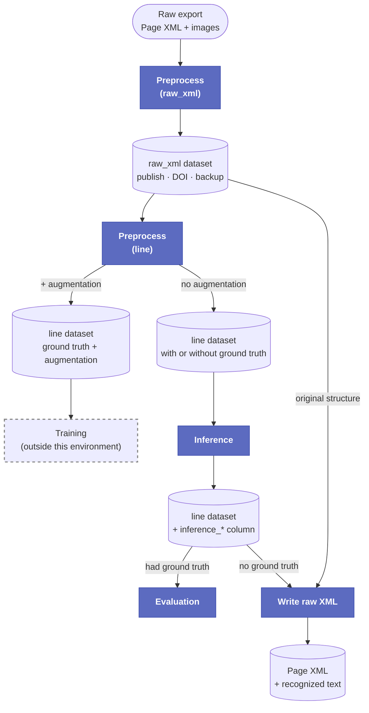

# Tutorial: Preprocessing a ZIP into a raw XML dataset

This tutorial walks through the most common preprocessing path: you have a ZIP file of
Page XML and image files, and you want a HuggingFace dataset that keeps that data
intact, for publishing, backing up, or preprocessing again later. This is the **raw_xml**
export mode, which keeps the full Page XML alongside each image rather than cutting it
into separate lines. It is not directly what you'll run inference on; see
"Export modes" below for how the pieces fit together.

If your data already lives in a HuggingFace dataset, see
[Preprocessing from HuggingFace](preprocessing_hf_raw_xml.md) instead. If you want a
dataset made of individual line images for training or evaluation, see
[Preprocessing a line-based dataset](preprocessing_line_based.md).

## Before you start

You will need:

- The **webhook API key** for the preprocessing workflow, set up by your administrator.
- Your data as a **ZIP file** (uploaded directly, or reachable at a public URL), containing
  Page XML files and their matching images.
- A **HuggingFace access token** with write access, and a name for the target dataset
  repository (for example `myorg/my-dataset`). [Create a token here](https://huggingface.co/settings/tokens)
  if you don't have one yet.
- The **email address** that should be notified when the job finishes.

!!! note "About the HuggingFace token"
    The token is only used for this one job. It is not saved anywhere as a reusable
    credential. It does, however, stay visible to administrators in n8n's execution
    history afterwards, so a [token](https://huggingface.co/docs/hub/security-tokens)
    scoped to just this repository is safer than a broad, account-wide one.

## Step by step

1. Open the preprocessing form (the "Preprocessing" card on the environment's landing
   page).
2. Enter your **webhook API key** under Authentication (get it from the system administration).
3. Under Data Source, choose how you want to provide your data:
    - **ZIP URL**: paste a public link to your ZIP file.
    - **ZIP upload**: upload the ZIP directly (up to 500 MB).

4. Under HuggingFace Target, fill in:
    - **Repository name**: where the result should be saved. It will be created
      automatically if it does not exist yet.
    - **HuggingFace token**: needs write access to that repository.
    - **Private repository**: check this if the dataset should not be public.

    !!! tip "Public or private?"
        On a free HuggingFace account, the built-in dataset viewer only works for
        **public** repositories, and free accounts get much less storage for private
        repos than public ones. But public really does mean public: anyone can see and
        download it, including bots that scrape the Hub. Only leave this unchecked if
        you're actually allowed to publish the data openly.

5. Under Processing Options, set **Export mode** to `raw_xml` (this is the default). If
   you're adding to a dataset you already published from an earlier export, check
   **Append** to add these new records to it instead of overwriting it, handy when you
   process your data in multiple batches. There's no automatic duplicate detection
   though, so appending the same source twice will duplicate those pages in the output.
6. Enter your **email address for status updates**.
7. Submit the form.

You should immediately see a confirmation that the request was accepted. The actual
processing happens in the background.

## Export modes

The **Export mode** field controls the shape of the output dataset. A common source of
confusion: **inference does not run on a raw_xml dataset directly**: it runs on a
`line` dataset instead. The diagram below shows how the pieces of this environment's
pipeline fit together:



The highlighted boxes are the services this environment actually runs (preprocessing,
inference, evaluation, write raw XML); everything else is data at rest. Training sits
outside this environment entirely, so it's marked separately.

Under the hood, export modes are handled by the
[pagexml-hf](https://github.com/The-Flow-Project/pagexml-hf) library, which supports
five of them; the form currently exposes four:

| Mode | One row per | What each row contains |
| --- | --- | --- |
| `raw_xml` | page | the full Page XML plus the page image; nothing is cut apart yet |
| `text` | page | the page image plus all its text regions concatenated into one block |
| `region` | text region | a cropped region image plus that region's text |
| `line` | text line | a cropped line image plus that line's own transcription |

- **raw_xml** (this tutorial, and the form's default): keeps the full Page XML and page
  image together. Use it to **publish** your data on the HuggingFace Hub (public
  datasets can get a DOI there), to keep a **backup**, and as the base you'll come back
  to later for **further preprocessing** into `line` format. It's also the dataset
  [Write raw XML](write_raw_xml.md) needs to know the original structure when merging
  recognized text back in.
- **line**: one row per text line, with its own cropped image. This is what actually
  feeds:
  - **[Inference](inference.md)**, when the lines don't have a transcription yet (check
    "Allow empty lines" so every line is included as a row for the model to fill in).
  - **[Evaluation](evaluation.md)**, when the lines already have a ground-truth
    transcription and you then run inference on top of that, to compare the two.
  - **Training**, when the lines have a ground-truth transcription, typically with
    augmentation turned on.

  See [Preprocessing a line-based dataset](preprocessing_line_based.md) for the
  step-by-step for all three.
- **text** and **region** are available too, for page-level or region-level text rather
  than individual lines, for whoever wants a differently-shaped dataset outside this
  environment's own pipeline.

### Getting your files back out of a raw_xml dataset

Since raw_xml keeps the original Page XML and image untouched, you can reconstruct the
original files from it at any time, for example after a migration, or to preprocess it
again with a different tool. Each row has an `image`, `xml_content`, `filename`, and
`project_name` column (see
[this public example dataset](https://huggingface.co/datasets/jwidmer/test-powerserver-preprocessing)).
With the [HuggingFace `datasets` library](https://huggingface.co/docs/datasets/index):

```python
import os
from datasets import load_dataset

ds = load_dataset("your-org/your-raw-xml-dataset", split="train")

for row in ds:
    basename, _ = os.path.splitext(row["filename"])
    project_dir = row["project_name"]
    os.makedirs(f"{project_dir}/page", exist_ok=True)
    with open(f"{project_dir}/page/{basename}.xml", "w", encoding="utf-8") as f:
        f.write(row["xml_content"])
    with open(f"{project_dir}/{row['filename']}", "wb") as f:
        f.write(row["image"]["bytes"])
```

This recreates the same `project/page/*.xml` + `project/*.jpg` layout
[pagexml-hf](https://github.com/The-Flow-Project/pagexml-hf) expects as input, so the
result can be zipped back up and preprocessed again.

## Expert settings (optional)

The form has an "Expert settings" section for less common adjustments:

| Field | What it does |
| --- | --- |
| Creator | An optional name stored in the output dataset's metadata. |
| Linemask and baseline recognition | Loads an existing Page XML segmentation, orders the lines, and generates line masks. Leave unchecked unless you specifically need this. |
| Min line width / height | Drops lines smaller than the given size, in pixels. Only meaningful for `line`-mode data. |
| Augmentation loops | Creates this many extra, augmented copies of each line image, following the augmentation recommendations from the TrOCR paper. Only meaningful for `line`-mode data. Set to 0 to disable. |
| Train ratio / Seed / Shuffle | Control how the dataset is split into training and test sets. |

Most of these can be left at their defaults for a first run.

!!! warning "Augmentation is for training data only"
    Turn augmentation on for a `line` dataset you're preparing for **training**: it can
    genuinely improve results there. It makes no sense for a dataset you're about to run
    **inference** or **evaluation** on: you'd end up recognizing or scoring duplicated,
    artificially distorted copies of the same lines instead of your real data. Leave it
    at 0 for those.

## What happens after you submit

1. If you uploaded a ZIP file directly, it is first stored temporarily so the
   preprocessing service can fetch it. (Uploaded files are removed automatically after
   seven days by a weekly cleanup job.)
2. n8n calls the preprocessing service to start the job.
3. n8n checks the job's status every 30 seconds.
4. When the job finishes, you receive an email, either confirming success with a link
   to the resulting dataset, or explaining what went wrong.

!!! note "Check the dataset card afterwards"
    The service automatically generates a dataset card (the repository's README) for
    the result, but it's fairly bare. Worth opening it on the Hub afterwards and filling
    in anything that matters (description, license, citation, and so on). The exact
    parameters used for this run are also saved as a JSON file among the repository's
    files, if you ever need to check exactly how a dataset was produced.

## Full parameter reference

This form covers the options most people need. The preprocessing service itself is a
separate, open-source project with its own documentation; see the
[API usage examples](https://github.com/The-Flow-Project/service-trocr-preprocess#api-usage)
and the
[full request model](https://github.com/The-Flow-Project/service-trocr-preprocess/blob/main/src/app/models.py)
in its repository if you want the complete, authoritative parameter list, including
anything not exposed in this form. If the service is running in development mode, it
also publishes interactive API docs at `/docs` on its own address.

## Next steps

Publish or back up this raw_xml dataset, and keep its name; you'll need it later for
[Write raw XML](write_raw_xml.md). To actually run recognition, preprocess the same
source again into a `line` dataset: see
[Preprocessing a line-based dataset](preprocessing_line_based.md), then
[Inference](inference.md).
